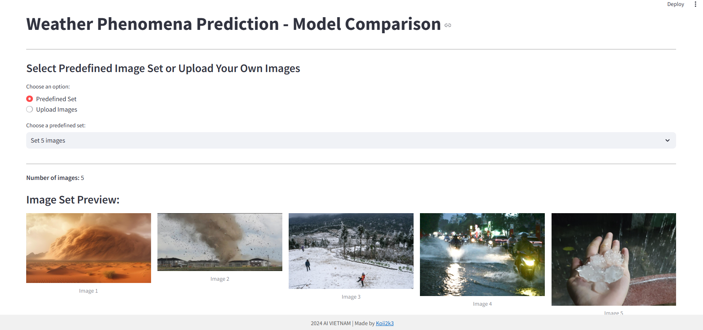
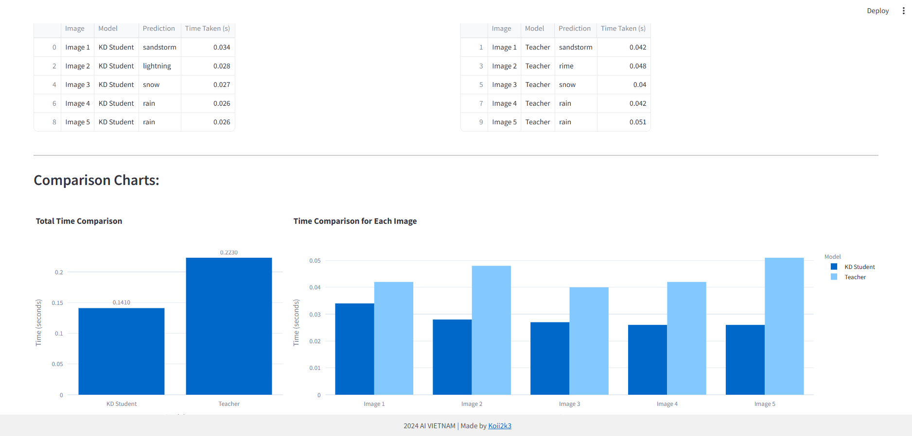

# Weather Phenomena Prediction - Model Comparison

This Streamlit application provides a platform to compare the performance of two deep learning models, a **Knowledge Distillation (KD) Student model** and a **Teacher model**, in predicting weather phenomena from images.

## Overview

The application allows users to:

-   **Select Predefined Image Sets:** Choose from preloaded sets of images for easy testing.
-   **Upload Custom Images:** Upload your own images to test the models with your data.
-   **View Image Previews:** Display the selected or uploaded images in a grid.
-   **Compare Model Predictions:** See side-by-side prediction results from both models.
-   **Analyze Performance:** Visualize time taken for predictions with charts for easy comparison.




## Key Features

-   **Model Comparison:** Directly compare the prediction accuracy and processing time of the KD Student model against the Teacher model.
-   **Interactive Interface:** The Streamlit application is user-friendly, with easy selection and upload options.
-   **Visualization:** Charts and dataframes provide a clear overview of the models' performance.
-   **Flexible Image Handling:** Supports both predefined sets and user-uploaded images, allowing a comprehensive analysis.
-   **Responsive Design:** Ensures the app is usable across different screen sizes.

## How It Works

1.  **Image Input:** Users can select a predefined image set or upload their own images through the interface.
2.  **Model Prediction:** The selected or uploaded images are processed through both the KD Student and Teacher models.
3.  **Result Display:** The application displays each image along with the predictions from both models, including time taken for each.
4.  **Performance Analysis:** Charts are generated to compare the total time and per-image time for each model.
5.  **User-friendly Tables:** The predicted labels and time taken for each image/model are displayed in interactive tables

## Technical Details

### Models

-   **KD Student Model:** A smaller ResNet model trained using knowledge distillation from the Teacher model.
-   **Teacher Model:** A larger ResNet model that serves as the teacher for the distillation process.
-   **ResNet Architecture:** The models are based on the ResNet architecture using residual blocks, designed for image classification.
    
### Frameworks and Libraries

-   **Streamlit:** Used to build the web application interface.
-   **PyTorch:** For the implementation of the deep learning models and related computations.
-   **NumPy:** For numerical array manipulation.
-   **PIL (Pillow):** For image processing and handling.
-   **Pandas:** For creating data frames and tabular presentation of results.
-   **Plotly:** For generating interactive and visually appealing charts.

### Model Loading

-   The models are loaded from `.pt` files, which contain the trained weights.

### Code Structure

The main logic is encapsulated within the `app.py` file, which includes:

-   **Configuration**: Setting up Streamlit configurations, logo and seed.
-   **Image Transformation**: A transformation function to prepare the images for input into the model.
-   **Model Definitions**: Class definitions for ResNet and ResidualBlock.
-   **Model Loading**: Loading weights of the pre-trained models.
-   **Streamlit App Logic**: Handling user input, running predictions, and displaying results.
-   **Results Display**: Show prediction results in dataframe format.
-   **Comparison Charts**: Visualizing time-taken performance with bar charts.
-   **Footer**: Add a constant footer.

## How to Run

1.  **Clone the Repository:**
    ```bash
    git clone <repository_url>
    cd <repository_directory>
    ```

2.  **Install Required Libraries:**
    ```bash
    pip install -r requirements.txt
    ```

3.  **Run the Streamlit App:**
    ```bash
    streamlit run app.py
    ```

4.  **Access the App:** Open your web browser and go to the URL provided by Streamlit.

## Repository Structure
├── app.py # Main Streamlit application file 
├── requirements.txt # List of Python libraries to install 
├── static # Folder containing static assets 
│ ├── aivn_favicon.png # Favicon for the app 
│ ├── aivn_logo.png # AI Vietnam Logo 
│ ├── set5 # Folder containing 5 images 
│ ├── set10 # Folder containing 10 images 
│ └── set15 # Folder containing 15 images 
└── model # Folder containing pre-trained model weights 
  ├── kdsamedata_wt.pt # KD Student model weights 
  └── teacher_wt.pt # Teacher model weights

## Additional Notes

-   The pre-trained model weights are included in the repository.
-   The application provides an easy way to load your custom images for model comparison.

## Contributor

-   [Koii2k3](https://github.com/Koii2k3)

## Contact

-   If you have any questions or feedback, feel free to contact us or open an issue on the GitHub repository.